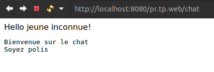
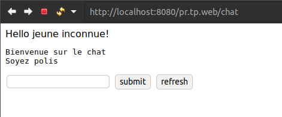
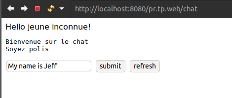
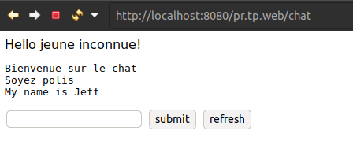
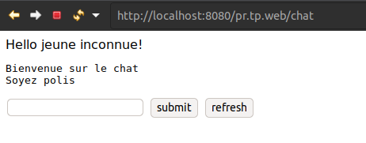
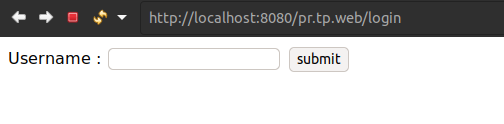
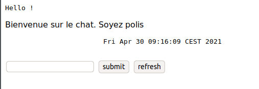

**Compte rendu TP6 : Les Servlets.**

 Binome : Tahiriniaina Andrian Rakotoarisoa, Sara Kasim

 Lien du git : https://gitlab.istic.univ-rennes1.fr/16013644/pr.tp.web.git


## Partie 1 : Chat anonyme

  ## Servlet /chat 
 Au début, une erreur 405 est affiché sur la page du chat due à l'absence des methodes HTTP : doPost ou doGet pour le chat.
 
  ## Contenu 
  Dans cette partie, le code sera implémenté dans le servlet Chat.
```java 
	@WebServlet("/chat")
	public class Chat extends HttpServlet {
		...
	}
```
  Comme indiqué, le contenue de la page chat doit afficher : 
 
 Bienvenue sur le chat <br/>
 Soyez polis 

 Pour se faire, il faut d'abord initialiser le contenu du Servlet chat dans la fonction 

 ```java 
 void init() throws ServletException
 ```
  avec : <br/>

 ```java
 public void init() throws ServletException {
		chatContent = new StringBuffer();
		chatContent.append("Bienvenue sur le chat").append("\n");
		chatContent.append("Soyez polis").append("\n");
	}
  ```
  La methode suivant permet de récupérer le StringBuffer sous format String : 

 ```java
 private String getContent() {
		return   this.chatContent.toString();
	}
  ```

 Maintenant, pour pouvoir afficher le contenu de la page chat, dans la methode doGet, il faut y mettre les éléments d'une page HTML et les afficher en utilisant un printWriter.

 ```java 
    @Override
	protected void doGet(HttpServletRequest request, HttpServletResponse response)
			throws ServletException, IOException {
    PrintWriter out = response.getWriter();
		out.println("<html>");
		out.println("<head><title>Chat anonyme</title></head>");
		out.println("<body>");
		String name = request.getParameter("name");
		if (name != null) {
			out.println("Hello " + name);
		} else {
			out.println("Hello jeune inconnue!");
		}
		
		//Affichage du contenue du message
		out.println("<pre>" + this.getContent() + "</pre>");
 ```
  Voici à quoi ressemble la page : 

  
 


 ## Formulaire
 Toujours dans la méthode doGet, rajouter les élements HTML pour le formulaire en utilisant le printWriter out.
```java 
@Override
	protected void doGet(HttpServletRequest request, HttpServletResponse response)
			throws ServletException, IOException {
		
		PrintWriter out = response.getWriter();
		out.println("<html>");
		out.println("<head><title>Chat anonyme</title></head>");
		out.println("<body>");
		String name = request.getParameter("name");
		if (name != null) {
			out.println("Hello " + name);
		} else {
			out.println("Hello jeune inconnue!");
		}
		
		//Affichage du contenue du message
		out.println("<pre>" + this.getContent() + "</pre>");
		
		//Formulaire
		out.println(" <form name= \"chatForm\" action= \"chat\" method=\"post\">");
		out.println("<input type=\"text\" name=\"ligne\" value=\"\"/>");
		out.println("<input type=\"submit\" name=\"action\" value=\"submit\"/>");
		out.println(" <input type=\"submit\" name=\"action\" value=\"refresh\" />");
		out.println(" </form>");
		
		out.println("</body>");
		out.println("</html>");
	}
  ```

  La page devrait maintenant ressembler à ceci : 

  

  ## Envoie du message :
  Pour pouvoir envoyer les messages, il faudra alors faire appel à la méthode doGet dans la méthode doPost TOUT EN RESPECTANT les conditions données dans le sujet pour pouvoir retourner la page du chat. La méthode doPost est implémenté comme suit : 
  ```java 
  @Override
	protected void doPost(HttpServletRequest request, HttpServletResponse response)
			throws ServletException, IOException {
		String action = request.getParameter("action");
		
		if (action != null && action.equals("submit")) {
		    // Ajouter la ligne au contenu
			chatContent.append(request.getParameter("ligne"));
			chatContent.append("\n");
			
			doGet(request, response);
		}
		else {
			this.init();
			doGet(request, response);
		}
	}
  ```
  Si l'utilisateur a cliqué sur le bouton submit, ce dernier ira récupérer le contenu champ text puisque qu'on le récupère à partir du paramètre "ligne". Sinon on rafraichit la page. 

  Voici le résultats lorsqu'on lance le servlet : 

  

  Bouton submit cliqué : 

  

  Bouton refresh cliqué : comme la page à l'initial.

  

##


## Partie 2 : Utilisation d'une JSP
 Dans cette partie, le code sera implémenté dans le servlet Chat2.
 ```java
 @WebServlet(name ="chat2", urlPatterns="/chat2")
 public class Chat2 extends HttpServlet {
 }
 ```
 Premièrement, créer le fichier chat.jsp contenant les élements HTML qui était dans le doGet et y rajouter l'lélément ci-dessous afin de pouvoir récupérer le contenue de la page.
 
 ```bash
 <pre>
    <%= request.getAttribute("content") %>
 </pre>
 ```

 la chat.jsp devrait ressembler à ceci : 

 ```bash
 <%@ page language="java" contentType="text/html; charset=UTF-8" pageEncoding="UTF-8"%>
<html>
	<head>
		<meta charset="UTF-8">
		<title>Chat anonyme</title>
	</head>
	<body>
		<pre>Hello !</pre>
		<p>
			<%= request.getAttribute("content") %>
		</p>	
		<form name= "chatForm" action= "chat" method="post">
			<input type="text" name="ligne" value=""/>
			<input type="submit" name="action" value="submit"/>
			<input type="submit" name="action" value="refresh" />
		</form>
	</body>
</html>
 ```
 ⚠️ Notez bien que si l'encodage était en ISO et pas en UTF-8, la page génèrera une erreur 500 mentionnant que l'encodage de la page n'est pas supporté provoquant une erreur interne du serveur.

 ⚠️ Il faut aussi que le fichier chat.jsp soit dans le répertoir **pr.tp.web/src/main/webapp.**

 Ce qui change dan la methode **doGet()** c'est qu'à la place de créer la page dans la méthode avec un printWriter, on va plutôt utiliser le fichier chat.jsp en lui indiquant le chemin vers l'url grace à **RequestDispatcher**.


 ```java
 @Override
	protected void doGet(HttpServletRequest request, HttpServletResponse response)
			throws ServletException, IOException {
		
			RequestDispatcher rd = request.getRequestDispatcher("/chat.jsp");
			request.setAttribute("content", chatContent.toString());
			rd.include(request, response);
	}
 ```
 ```bash
  RequestDispatcher rd = request.getRequestDispatcher("/chat.jsp"); 
 ```
  pour indiqué le chemin vers chat.jsp

 ```bash
  request.setAttribute("content", chatContent.toString());
 ```
  pour définir le contenu de la page.

 
##


## Partie 3 : SESSIONS
 Pour cette partie, nous avons rajouté deux élements au projet : un servlet login et le fichier login.jsp qui serviront pour créer la page du login.

 Le principe, c'est que lorsque l'utilisateur s'est connecté, celui-ci va être rediriger vers la page du chat. Si l'utilisateur n'as pas entré son nom mais a quand cliqué sur le bouton **"submit"** celui-ci sera rediriger vers la page du login **AVEC** un message rouge mentionnant que l'username n'est pas valide.

 ```mermaid
 sequenceDiagram
	participant Login
	participant Chat
	alt UserLoging
	Login->>Chat: Username entré
		alt userLogged
    	Chat->>Chat: Affiche la page 
    	else notLogged
    	Chat->>Login: Username is wrong
		end
	else champVide
	Login->>Login:Username is wrong
    end
 ```
 Dans le servlet login :
 ```java
 @WebServlet("/login")
 public class login extends HttpServlet {
	 ...
 }
 ```
  dans le doGet, même principe que celle du chat avec un fichier jsp.

 ```java
 /**
	 * @see HttpServlet#doPost(HttpServletRequest request, HttpServletResponse response)
	 */
	protected void doGet(HttpServletRequest request, HttpServletResponse response)
			throws ServletException, IOException {
		

		RequestDispatcher rd = getServletContext().getRequestDispatcher("/login.jsp");
		rd.forward(request, response);
	}
 ```
 Dans le doPost : vérification de l'évènement sur le bouton submit et du champ username 

 ```java
 /**
	 * @see HttpServlet#doPost(HttpServletRequest request, HttpServletResponse response)
	 */
	protected void doPost(HttpServletRequest request, HttpServletResponse response) throws ServletException, IOException {
		String action = request.getParameter("action");
		String user = request.getParameter("user");
		
		//If the user submitted his username
		if(user != null && action != null && action.equals("submit") ) {
		//redirecting to the chat page
			response.sendRedirect("chat2");

		}
		else  {
			RequestDispatcher rd = getServletContext().getRequestDispatcher("/login.jsp");
			PrintWriter out = response.getWriter();
			out.println(" <font color=red> username is wrong.</font> ");
			rd.include(request, response);
			
		}
	}
 ```
 login.jsp : 

 ```bash
 <%@ page language="java" contentType="text/html; charset=UTF-8" pageEncoding="UTF-8"%>

 <html>
	<head>
		<meta charset="UTF-8">
		<title>Login Servlet</title>
	</head>
	<body>
		
		<form action="chat2"  method="post">
			Username : <input type="text" name="user" />
			<input type="submit" name="action" value="submit" />
		</form>
	</body>
 </html>
 ```

 ⚠️ Notez bien que dans la balise **form** , en attribuant la valeur chat2 à l'action, lors de la connection i.e lorsque le bouton submit a été cliqué, les données du formulaire seront envoyé au servlet chat2. Puis, dans Chat2, on les récupère grace à une HttpSession.


 Résultat : 

 


 
 Dans le servlet chat2, le doGet ressemblera maintenant comme suit : 

 ```java
 @Override
	protected void doGet(HttpServletRequest request, HttpServletResponse response)
			throws ServletException, IOException {

		//Création de la session http
		boolean create = true ;
		HttpSession session = request.getSession(create);
		//Pour récupérer le donnée user
		String user = (String) session.getAttribute("user");
		
		//Si le champ usename est vide, redirection vers la page login
		if(user == null) {
			response.sendRedirect("login");
			
		//sinon affichage de la page du chat
		}else {
			
			RequestDispatcher rd = request.getRequestDispatcher("/chat.jsp");
			request.setAttribute("content", chatContent.toString());
			rd.include(request, response);
		}
	}
 ```
 Le soucis c'est que lors du teste, sur la page du login, quand on appuie sur le bouton submit, champ vide ou pas le user se redirige directement vers la page du chat qui, ce dernier, redirigera le user vers la page du login (voir la condition if dans doGet de Chat2).
 
 Ce qui implique qu'au fait le champ user est null.

 Dans la méthode doPost du servlet login, la vérification du champ semble ne pas fonctionné comme prévus.

 Enfin pour l'affichage du chat avec la date, il suffit de rajouter l'élement suivant dans le chat.jsp

 ```bash
 <%@ page import="java.util.Date"%>
 <%=new Date()%>
 ```
 Résultat : 
 

 chat.jsp : 
 ```bash
 <%@ page language="java" contentType="text/html; charset=UTF-8" pageEncoding="UTF-8"%>
 <%@ page import="java.util.Date"%>

<html>
	<head>
		<meta charset="UTF-8">
		<title>Chat anonyme</title>
	</head>
	<body>
	
		<pre>Hello !</pre>

		<p>
			<%= request.getAttribute("content") %>	
		</p>
		<pre><%=new Date()%></pre>
			
		<form name= "chatForm" action= "chat" method="post">
			<input type="text" name="ligne" value=""/>
			<input type="submit" name="action" value="submit"/>
			<input type="submit" name="action" value="refresh" />
		</form>
	</body>
</html>

 ```

##


## Partie 4 : Configuration du message de bienvenue
 Dans le fichier web.xml, en rajoutant 
```bash
 <context-param>
    <param-name>welcome</param-name>
    <param-value>Bienvenue sur le chat. Soyez polis</param-value>
 </context-param>
 ```
 on peut accéder au paramètre de l'application dont le nom est **welcome** et sa valeur est **Bienvenue sur le chat. Soyez polis**

 Afin de récupérer ce paramètre, dans le servlet Chat2 (le code pourrait bien être implémenter dans le servlet Chat ) on récupère  le paramètre de l'application dont le nom est **welcome** graâce à l'instruction :
 ```bash
 	ServletContext context = config.getServletContext();
		String contenue = context.getInitParameter("welcome");
 ```
 puis on va concatèné celui-ci avec le contenue du chat **chatContent**

 ```java
 @WebServlet(name ="chat2", urlPatterns="/chat2")
public class Chat2 extends HttpServlet {
	private static final long serialVersionUID = 197811968639586823L;
	private StringBuffer chatContent;
	
	
	@Override
	public void init(ServletConfig config) throws ServletException {
		//PARTIE 4 : Configuration du message de bienvenue
		//Recupération des paramètres de l'application
		ServletContext context = config.getServletContext();
		String contenue = context.getInitParameter("welcome");
		
		//création du contenue de la page chat
		chatContent = new StringBuffer();
		chatContent.append(contenue).append("\n");
	}
 ```
 
##
